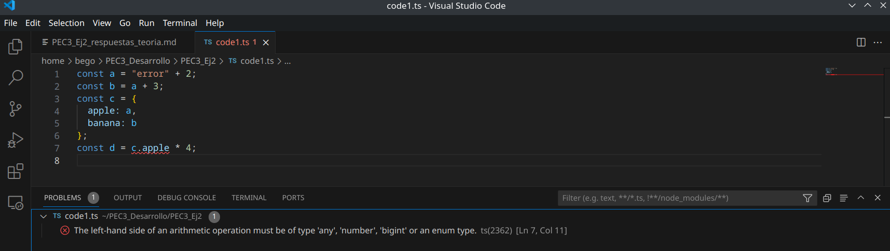

## Primeros códigos en TypeScript 

### Ejercicio 1
He modificado el valor de a para que diera error. Esto ha hecho que dé error el valor de d porque dependía del valor de a. Me parece muy bien que detecte los errores que pudieran darse en todo el código al cambiar solo la primera línea. En JavaScript, solo nos daríamos cuenta de que hay un error al ejecutar el código y darnos el error. Aquí nos damos cuenta mientras estamos escribiendo el código.

 

### Ejercicio 2
a - número, b - string, c - string, d - array de booleanos, e - objeto con una propiedad 'type' de tipo string, f - array de números o booleanos, g - array de números y h - null. Se han inferido estos datos en función del valor que hemos proporcionado a las variables: a, un número; b y c, strings; d, un array de booleanos; e, un objeto con la estructura type: 'string'; f, un array con un número y un booleano; g, un array con un número dentro, y h, null.

### Ejercicio 3
1. La variable constante i tiene un valor de 3, así que no podemos darle el valor de 4 porque siempre será 3.
2. j es un array de número y, por tanto, el valor esperado siempre será un número. Al intentar añadir una string (j.push('5')), da error.
3. Never se usa para representar valores que nunca van a suceder, como funciones que lanzan excepciones o entran en bucles infinitos. El tipo never no tiene ningún valor, por eso, no podemos asignarle 4.
4. Al asignarle a 1 el tipo 'unknown', no se puede realizar operaciones con él, porque TypeScript lo considera 'unknown' y no lo considera number.

### Ejercicio 4 
Una clase, tanto en TypeScript como en JavaScript, es un bloque de código para definir las propiedades y los métodos de un objeto. Sin embargo, en TypeScript, la interfaz se utiliza para crear una estructura común en diferentes clases o para implementar múltiples interfaces en una sola clase.
